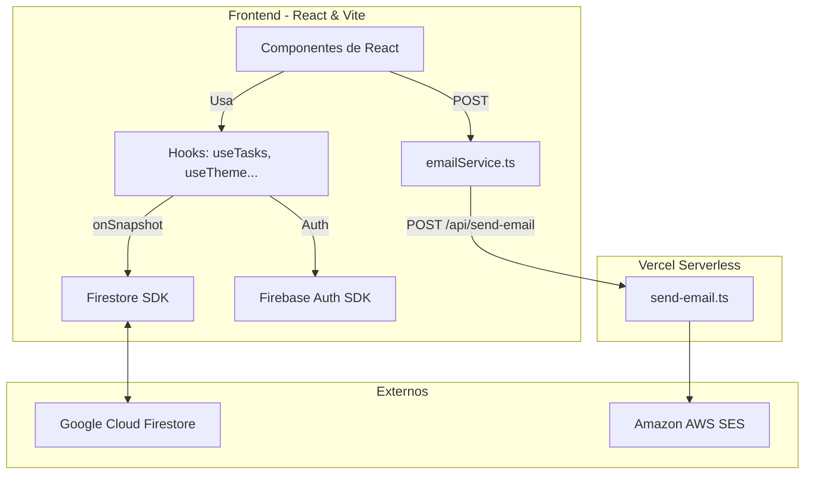

# Mate Code App — Gestor de tareas

SPA de gestión de tareas desarrollada como proyecto integrador del Módulo 4 de Soy Henry. Permite crear, organizar y hacer seguimiento de tareas con soporte de prioridades, fechas de vencimiento, etiquetas y resumen por email.

[](#)
[](#)
[](#)
[](#)
[](#)
[](#)

**URL de producción:** [https://matecode-task-manager.vercel.app](https://matecode-task-manager.vercel.app)

---

## Demo

<div align="center">

</div>

<div align="center">
<video src="https://github.com/user-attachments/assets/b7683a88-37d7-4e95-ae33-8b0cfed8e6cf" controls width="380"></video>
</div>

Un recorrido completo por MateCode: desde las pantallas de autenticación (login, registro y recuperación de contraseña) hasta el task manager en acción. Se pueden ver los filtros, la creación, edición y eliminación de tareas, el marcado como completadas, la guía de uso integrada, el envío del resumen por email y cómo llega el email al destinatario.

---

## Stack

| Capa | Tecnología |
|---|---|
| Frontend | React 19 + TypeScript, Vite, Tabler Icons |
| Auth + DB | Firebase Authentication + Firestore |
| Email | AWS SES via Vercel Function |
| Tests | Vitest + React Testing Library |
| Deploy | Vercel (frontend + serverless functions) |

---

## Funcionalidades

| Área | Detalle |
|---|---|
| **Autenticación** | Login/registro con email o Google · Recuperación de contraseña · Checklist de requisitos en tiempo real · Sesión persistente · Rutas protegidas |
| **Tareas** | CRUD completo · Campos: título, descripción, prioridad (baja/media/alta), fecha + hora de vencimiento, etiqueta · Sincronización en tiempo real (`onSnapshot`) · Descripciones largas expandibles con "Ver más / Ver menos" |
| **Borrado** | Undo individual (5 s) · Undo masivo de completadas (10 s) — ambos con toast de "Deshacer" |
| **Búsqueda y filtros** | Buscador en tiempo real por título, descripción y etiqueta (insensible a acentos) · Filtros: todas / pendientes / completadas · Orden: recientes / prioridad / fecha |
| **Temas** | Clásico ☀️ / Nocturno 🌙 / Vívido ✨ · Persistidos en Firestore para sincronizar entre dispositivos · Sin flash de tema incorrecto al cargar |
| **UI / UX** | Vista lista y grilla con toggle · FAB flotante en mobile · Skeletons que respetan la vista activa (sin layout shift) · Toasts en todas las acciones · Navegación por teclado en dropdowns (flechas, Enter, Home/End) · Tareas vencidas siempre en rojo sobre cualquier prioridad |
| **Email** | Resumen HTML responsive agrupado por prioridad · Acento visual según tema del usuario · Remitente "MateCode" via AWS SES |
| **Misc** | Dashboard con stats y barra de progreso · Modal de instrucciones de uso · Diseño mobile-first · Iconografía consistente con Tabler Icons |

---

## Instalación local

```bash
git clone <url-del-repo>
cd ProyectoIntegrador-M4-ACPJ
npm install
cp .env.example .env   # completar con credenciales reales
npm run dev
# Para probar el email localmente:
npx vercel dev
```

| Script | Descripción |
|---|---|
| `npm run dev` | Servidor de desarrollo |
| `npm run build` | Build de producción |
| `npm run test` | Tests con Vitest |
| `npm run lint` | ESLint |

---

## Variables de entorno

Copiar `.env.example` a `.env` y completar con los valores reales. **Nunca commitear `.env`.**

```env
# Firebase — prefijo VITE_ obligatorio para que Vite las exponga al cliente
VITE_FIREBASE_API_KEY=
VITE_FIREBASE_AUTH_DOMAIN=
VITE_FIREBASE_PROJECT_ID=
VITE_FIREBASE_STORAGE_BUCKET=
VITE_FIREBASE_MESSAGING_SENDER_ID=
VITE_FIREBASE_APP_ID=

# AWS SES — SIN prefijo VITE_: solo las usa el servidor (Vercel Function)
AWS_ACCESS_KEY_ID=
AWS_SECRET_ACCESS_KEY=
AWS_REGION=
SES_FROM_EMAIL=

# URL pública de la app (usada en el email de resumen)
APP_URL=https://matecode-task-manager.vercel.app
```

> **AWS SES en sandbox:** el email solo llega a direcciones verificadas manualmente en la consola de AWS. Para uso en producción real se requiere solicitar acceso productivo a AWS.

---

## Arquitectura



### Separación de responsabilidades

Los componentes solo describen qué se muestra. La lógica vive en hooks (`useTasks`, `useTaskItem`, `useAuth`, `useTheme`) y la comunicación con servicios externos en `src/services/`.

```
src/
├── hooks/        # useTasks (onSnapshot + CRUD), useAuth (onAuthStateChanged), useTheme, useTaskItem, useViewMode
├── services/     # firebase.ts (init), firestoreService.ts (CRUD), emailService.ts (POST a la función)
├── types/        # Task, TaskFormValues, TaskFilter, TaskSort, Theme — interfaces compartidas
├── utils/        # taskHelpers.ts (filtros, orden, colores), firebaseErrors.ts, format.ts, validate.ts
├── routes/       # ProtectedRoute, PublicOnlyRoute
├── pages/        # Login, Register, ForgotPassword, Tasks
├── components/   # TodoForm, TaskEditForm, TaskCard, TaskGrid, TodoList, CustomSelect, Skeleton...
└── styles/       # CSS puro con variables por tema (tokens.css + módulos por sección)
api/
└── send-email.ts # Vercel Function: valida payload, genera HTML temático, llama a AWS SES
```

### Decisiones técnicas clave

| Decisión | Por qué |
|---|---|
| CSS puro con variables | Tres temas sin librerías. `data-theme` en `<html>` + `color-scheme` por tema para que los controles nativos (pickers de fecha/hora) respeten el modo claro/oscuro |
| `useLayoutEffect` para temas | Evita flash de tema incorrecto (FOUC) al aplicar `data-theme` antes del primer paint |
| `onSnapshot` en lugar de `getDocs` | Suscripción persistente: cualquier cambio en Firestore se refleja en la UI sin recargar |
| `CustomSelect` en lugar de `<select>` nativo | El `<select>` nativo ignora CSS personalizado en todos los SO. `CustomSelect` implementa ARIA listbox completo con navegación de teclado |
| Función de email autónoma | Con `"type": "module"` en `package.json`, Node.js requiere extensiones `.js` en imports locales al compilar TypeScript. Mantener todo en un solo archivo evita el problema de resolución de módulos en Vercel |
| Patrón undo en eliminación | El borrado en Firestore es inmediato e irreversible. La tarea desaparece visualmente de inmediato pero se elimina en Firestore después de 5 s (10 s para borrado masivo); un `Map<taskId, timerId>` gestiona las cancelaciones pendientes |
| Doble capa de seguridad | El cliente filtra con `where('userId', '==', uid)` y las reglas de Firestore validan `request.auth.uid == resource.data.userId`. Aunque alguien manipule el cliente, Firestore rechaza la operación |

---

## Flujo de email de resumen

1. Usuario hace clic en **Enviar resumen** → `Tasks.tsx` llama a `sendTaskSummary(email, tasks, { name, theme })`
2. `emailService.ts` formatea fechas en zona horaria local (el servidor corre en UTC) y hace `POST /api/send-email`
3. La Vercel Function valida el payload y mapea el tema a un color de acento (`classic` → `#4F6EF7`, `midnight` → `#5c7cfa`, `gradient` → `#7c3aed`)
4. Genera HTML con tareas agrupadas en grid de 2 columnas (tablas anidadas para compatibilidad con clientes de email) y llama a AWS SES con versiones HTML + texto plano

> **Nota:** AWS SES opera en modo sandbox, por lo que el envío solo funciona hacia direcciones verificadas manualmente en la consola de AWS. La funcionalidad está implementada y operativa — la restricción es del entorno de pruebas, no del código.

<div align="center">

</div>

---

## Seguridad de Firestore

```
rules_version = '2';
service cloud.firestore {
  match /databases/{database}/documents {
    match /tasks/{taskId} {
      allow read: if request.auth != null
        && request.auth.uid == resource.data.userId;
      allow create: if request.auth != null
        && request.auth.uid == request.resource.data.userId;
      allow update: if request.auth != null
        && request.auth.uid == resource.data.userId
        && request.resource.data.userId == resource.data.userId;
      allow delete: if request.auth != null
        && request.auth.uid == resource.data.userId;
    }
    match /users/{uid} {
      allow read, write: if request.auth != null && request.auth.uid == uid;
    }
  }
}
```

---

## Tests

24 tests en 5 archivos · `npm run test`

| Archivo | Qué prueba |
|---|---|
| `firebaseErrors.test.ts` | Mapeo de códigos de error Firebase a mensajes legibles · función pura, sin mocks |
| `emailService.test.ts` | Construcción del payload, formateo de fechas en zona local, manejo de errores del serverless |
| `taskHelpers.test.ts` | Filtrado y ordenamiento de tareas |
| `TodoForm.test.tsx` | Validación, envío y manejo de errores del formulario · Firebase mockeado |
| `TodoList.test.tsx` | Renderizado de lista y acciones · Firebase mockeado |

---

## Desarrollo Asistido por IA

El proyecto se desarrolló usando Claude como copiloto de desarrollo. El modelo asistió en debugging de CSS, validación de patrones de React y generación de casos de prueba; las decisiones de arquitectura, producto y tecnología fueron de mi autoría.

### Rol del modelo vs. rol propio

| Mi rol (decisiones de producto y arquitectura) | Rol del modelo (ejecución y validación) |
|---|---|
| CSS puro con variables en lugar de Tailwind | Diagnóstico de colisiones de especificidad CSS |
| Hooks personalizados para separar lógica de UI | Validación del comportamiento de `useLayoutEffect` vs `useEffect` |
| Persistencia multi-dispositivo de temas en Firestore | Generación de hipótesis de error en los tests de fechas UTC vs. local |
| Reglas de seguridad de Firestore por UID | Identificación de edge cases en el flujo de onSnapshot |
| Decisión de descartar el asistente Tyrion/Gemini | Refactors de componentes y módulos CSS |

### Patrones de uso

- **Primero entender, después implementar.** Antes de escribir código pedía la explicación del patrón subyacente. Si no quedaba claro, volvía a preguntar con otra formulación.
- **Opciones con trade-offs antes de decidir.** Cuando había más de una forma de resolver algo, pedía las alternativas y yo elegía según el contexto.
- **Revisión línea por línea.** Nada entraba al proyecto sin que pudiera explicar qué hace y por qué.
- **Iteración hasta que quedaba bien.** Varias features se implementaron, descartaron y rehacieron — no por errores técnicos sino porque el resultado no estaba a la altura del resto de la app.

### Decisión de alcance: asistente de IA descartado

La guía del PI incluía un asistente conversacional (Tyrion Lannister sobre Gemini API). Lo implementé — llegué a tener la serverless function, el proxy y el system prompt funcionando — pero la evaluación fue clara: agregaba complejidad, dependía de una API key adicional y el resultado no estaba a la altura del resto de la app en UX ni en valor para el usuario. Lo descarté deliberadamente: es preferible tener menos features bien ejecutadas que muchas a medias.

---

## 🛠️ Otras herramientas

| Herramienta | Uso |
|---|---|
| Canva | Edición de capturas de pantalla en dispositivos para el README |

---

## 👩‍💻 Desarrolladora

Analía Pérez Juliá

---

## 📄 Licencia

MIT © 2026 Halina87
