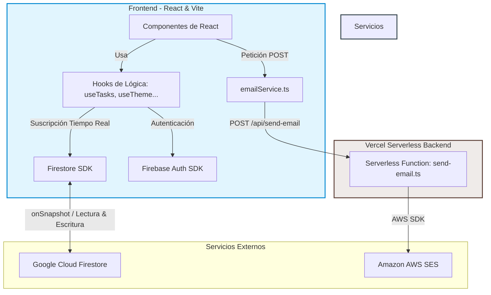

# Mate Code App — Gestor de tareas

SPA de gestión de tareas desarrollada como proyecto integrador del Módulo 4 de Soy Henry. Permite crear, organizar y hacer seguimiento de tareas con soporte de prioridades, fechas de vencimiento, etiquetas y resumen por email.

[](#)
[](#)
[](#)
[](#)
[](#)
[](#)

**URL de producción:** [https://matecode-task-manager.vercel.app](https://matecode-task-manager.vercel.app)

---

## Stack

| Capa | Tecnología |
|---|---|
| Frontend | React 19 + TypeScript, Vite, Tabler Icons |
| Auth + DB | Firebase Authentication + Firestore |
| Email | AWS SES via Vercel Function |
| Tests | Vitest + React Testing Library |
| Deploy | Vercel (frontend + serverless functions) |

---

## Funcionalidades

- Registro y login con email/password y Google
- Validación estricta de contraseña en el registro: mínimo 6 caracteres, una mayúscula, una minúscula y un número
- Recuperación de contraseña via email (Firebase Password Reset) desde la pantalla de login
- Sesión persistente con redirección automática
- Rutas protegidas (sin acceso sin autenticación)
- Menú de navegación en header con hamburguesa para todos los tamaños de pantalla: muestra avatar (foto de Google o inicial), email del usuario, acceso a resumen por email, instrucciones de uso y cierre de sesión
- Instrucciones de uso integradas en la app: modal accesible desde el menú, con guía rápida de las funcionalidades principales
- Iconografía consistente con **Tabler Icons** (`@tabler/icons-react`): reemplaza emojis en header, modal de ayuda y lista de tareas
- CRUD completo de tareas con sincronización en tiempo real (Firestore `onSnapshot`)
- Eliminación individual con patrón **undo**: la tarea desaparece al instante y un toast ofrece "Deshacer" durante 5 segundos; si no se usa, el borrado se confirma en Firestore
- Eliminación masiva de tareas completadas con confirmación inline (sin dialogs del sistema)
- Dashboard con saludo personalizado, estadísticas de tareas y barra de progreso con degradado
- Campos por tarea: título, descripción, prioridad (baja/media/alta), fecha y hora de vencimiento, etiqueta
- Cards con chips semánticos de prioridad y estado
- Filtros: todas / pendientes / completadas
- Orden: más recientes / por prioridad / por fecha
- Tres temas visuales: Clásico (☀️), Nocturno (🌙), Vívido (✨) — seleccionables por el usuario, persistidos en localStorage y Firestore para sincronizar entre dispositivos
- Dropdowns de filtro y orden con componente `CustomSelect` a medida (reemplaza `<select>` nativo para mantener coherencia visual entre temas)
- Toast notifications temáticas: el fondo y el texto se adaptan al tema activo mediante variables CSS
- Diseño mobile-first: en pantallas ≤767px la vista se fuerza a grid, la toolbar se reduce a una fila con filtros y orden, y la creación de tareas se centraliza en el FAB flotante
- Resumen de tareas por email con diseño responsive, agrupado por prioridad, tareas en grid de 2 columnas y formato de fecha dd/mm/aa 24hs
- Loading skeletons y toast notifications en todas las acciones
- Footer con créditos de autoría y link al portfolio

---

## Instalación local

```bash
# 1. Clonar el repositorio
git clone <url-del-repo>
cd ProyectoIntegrador-M4-ACPJ

# 2. Instalar dependencias
npm install

# 3. Configurar variables de entorno
cp .env.example .env
# Completar .env con las credenciales reales (ver sección Variables de entorno)

# 4. Iniciar en desarrollo
npm run dev

# 5. Para probar las Vercel Functions localmente (email)
npx vercel dev
```

### Scripts disponibles

```bash
npm run dev       # servidor de desarrollo
npm run build     # build de producción
npm run preview   # preview del build
npm run test      # tests con Vitest
npm run lint      # ESLint
```

---

## Variables de entorno

Copiar `.env.example` a `.env` y completar con los valores reales. Nunca commitear `.env`.

```env
# Firebase — prefijo VITE_ obligatorio para que Vite las exponga al cliente
VITE_FIREBASE_API_KEY=
VITE_FIREBASE_AUTH_DOMAIN=
VITE_FIREBASE_PROJECT_ID=
VITE_FIREBASE_STORAGE_BUCKET=
VITE_FIREBASE_MESSAGING_SENDER_ID=
VITE_FIREBASE_APP_ID=

# AWS SES — SIN prefijo VITE_: solo las usa el servidor (Vercel Function)
AWS_ACCESS_KEY_ID=
AWS_SECRET_ACCESS_KEY=
AWS_REGION=
SES_FROM_EMAIL=

# URL pública de la app (usada en el email de resumen)
APP_URL=https://matecode-task-manager.vercel.app
```

En Vercel, las variables con prefijo `VITE_` se configuran como variables de entorno del proyecto; las sin prefijo solo están disponibles en el servidor.

> **AWS SES en sandbox**: la app está en modo sandbox de AWS SES. Esto significa que el email de resumen solo funciona si el destinatario fue verificado manualmente en la consola de AWS. Si al probar la funcionalidad de email no llega nada, es por esta limitación — no por un error en la app. Para uso en producción real se requiere solicitar a AWS el acceso productivo ("Request production access").

---

## Arquitectura y decisiones técnicas

### Diagrama de Arquitectura del Sistema



### Separación de responsabilidades

Los componentes solo describen qué se muestra. La lógica de negocio vive en hooks (`useTasks`, `useTaskItem`, `useAuth`, `useTheme`) y la comunicación con servicios externos en `src/services/`. Esta separación hace que cada parte del código tenga una razón única para cambiar y facilita el testing de la lógica sin depender del DOM.

```
src/
├── components/   # UI: TaskCard, TaskModal, TaskEditForm, HelpModal, CustomSelect, DueChip...
├── hooks/        # Lógica reutilizable: useTasks, useTaskItem, useAuth, useTheme
├── services/     # Firebase, Firestore, emailService
├── pages/        # Vistas: Login, Register, ForgotPassword, Tasks
├── routes/       # Enrutamiento y rutas protegidas (ProtectedRoute, PublicOnlyRoute)
├── styles/
│   ├── tokens.css    # Variables de diseño (colores, espaciado, radios por tema)
│   ├── base.css      # Reset suave, tipografía, elementos HTML
│   ├── components.css # Primitivas: .card, .badge, .empty
│   ├── buttons.css   # Sistema de botones (.btn con flex centrado para íconos)
│   ├── forms.css     # Layout de formularios
│   ├── select.css    # Componente CustomSelect
│   ├── header.css    # Header sticky, theme toggle centrado, menú hamburguesa
│   ├── stats.css     # Sección de bienvenida, stat cards, barra de progreso
│   ├── toolbar.css   # Controls bar, chips, filtros, toggle de vista
│   ├── modal.css     # Animaciones, FAB, modal de nueva tarea, modal de ayuda
│   ├── tasks.css     # Ítems de tarea, lista, confirmación de borrado
│   ├── grid.css      # Vista de cuadrícula (TaskGrid, TaskCard)
│   ├── auth.css      # Vistas de login/registro/recuperación
│   └── skeleton.css  # Loading placeholders
├── utils/        # Helpers: format.ts, taskHelpers.ts, firebaseErrors.ts
└── types/        # Interfaces compartidas: Task, TaskFormValues, Theme...

api/
└── send-email.ts   # Vercel Function autónoma: valida payload, genera HTML y llama a SES
```

### Tiempo real con onSnapshot

`useTasks` se suscribe a Firestore con `onSnapshot` y cancela la suscripción al desmontar el componente, evitando fugas de memoria. La query filtra por `userId` tanto en el cliente como en las reglas de Firestore.

### Temas sin flash

El tema se aplica con `data-theme` en `<html>`. Un script inline en `index.html` lee `localStorage` antes del primer render de React para evitar el flash de tema incorrecto. `useLayoutEffect` sincroniza el atributo en cada cambio. El tema también se persiste en `users/{uid}` en Firestore para sincronizar entre dispositivos.

### Diseño mobile-first

En pantallas ≤767px, un hook `matchMedia` detecta el breakpoint y deriva el valor `effectiveView` que fuerza la vista a grid independientemente de la preferencia guardada. La toolbar colapsa a una sola fila con filtros y selector de orden; el botón de nueva tarea desaparece y se reemplaza por un FAB flotante. El CSS usa clases modificadoras BEM (`--view`, `--filters`, `--sort`, `--action`) para controlar la visibilidad sin lógica condicional en el JSX.

### Credenciales AWS siempre en el servidor

El frontend nunca habla con AWS directamente. Llama a `POST /api/send-email` (Vercel Function), que tiene acceso a las credenciales en variables de entorno del servidor. Las variables sin prefijo `VITE_` no llegan nunca al bundle del cliente.

### Función de email autónoma (sin imports locales)

`api/send-email.ts` es completamente autónomo: el template HTML, la lógica de generación y el handler de SES conviven en el mismo archivo. Esta decisión responde a una limitación concreta del entorno Vercel con `"type": "module"` en `package.json`: en modo ESM, Node.js exige extensiones explícitas (`.js`) en los imports locales al compilar TypeScript a JavaScript. Al no poder usar `import` de otros `.ts` locales sin configuración adicional del bundler, la solución más robusta es mantener la función como un único módulo sin dependencias internas.

---

## Flujo de email de resumen

1. El usuario hace clic en **Enviar resumen** en el menú del header
2. `Tasks.tsx` llama a `sendTaskSummary(email, tasks, { name, theme })`
3. `emailService.ts` formatea las fechas en zona horaria local (el servidor corre en UTC) y hace `POST /api/send-email`
4. La Vercel Function valida el payload y mapea el tema del usuario a un color de acento (`classic` → `#4F6EF7`, `midnight` → `#5c7cfa`, `gradient` → `#7c3aed`)
5. La función genera el HTML internamente: agrupa las tareas pendientes y completadas con sus tarjetas de estadísticas, renderiza las tareas en un grid de 2 columnas usando tablas anidadas (compatible con todos los clientes de email), construye el HTML reemplazando los `{{PLACEHOLDERS}}` y genera el fallback en texto plano
6. AWS SES envía el email con ambas versiones (HTML + texto)

---

## Seguridad de Firestore

Cada usuario solo puede leer y escribir sus propias tareas. Las reglas validan `userId` tanto en lectura como en escritura:

```
rules_version = '2';
service cloud.firestore {
  match /databases/{database}/documents {
    // Cada tarea pertenece a un único usuario (campo userId).
    // El aislamiento entre usuarios se garantiza acá: nadie puede
    // leer ni escribir una tarea cuyo userId no sea su propio uid.
    match /tasks/{taskId} {
      // Leer: solo si sos el dueño del documento existente.
      // Aplica tanto a lecturas de un doc puntual como a queries
      // (la query de useTasks filtra por userId == uid, así que
      // todos los docs devueltos cumplen esta condición).
      allow read: if request.auth != null
        && request.auth.uid == resource.data.userId;
      // Crear: el userId del nuevo documento tiene que ser el tuyo.
      // En create todavía no existe "resource", se usa request.resource.
      allow create: if request.auth != null
        && request.auth.uid == request.resource.data.userId;
      // Actualizar: tenés que ser el dueño Y no podés reasignar la
      // tarea a otro usuario (el userId no puede cambiar).
      allow update: if request.auth != null
        && request.auth.uid == resource.data.userId
        && request.resource.data.userId == resource.data.userId;
      // Borrar: solo el dueño.
      allow delete: if request.auth != null
        && request.auth.uid == resource.data.userId;
    }

    match /users/{uid} {
      allow read, write: if request.auth != null && request.auth.uid == uid;
    }
  }
}
```

---

## Tests

```bash
npm run test
```

Cobertura actual: 15 tests en 4 archivos.

- `emailService.test.ts`: verifica que el payload se construye correctamente, que las fechas se formatean en zona horaria local, y el manejo de errores del serverless
- `taskHelpers.test.ts`: verifica el filtrado y ordenamiento de tareas
- `TodoForm.test.tsx` y `TodoList.test.tsx`: tests de componentes con mocks de Firebase

---

## Desarrollo Asistido por IA & Ingeniería de Prompts

Este proyecto se desarrolló adoptando metodologías modernas de **Desarrollo Asistido por IA (AI-Assisted Engineering)**, utilizando modelos de lenguaje (principalmente Claude) como un "copiloto de desarrollo" (Peer Programming) enfocado en maximizar la productividad, agilizar el debugging y asegurar la calidad del código.

### Liderazgo y Toma de Decisiones (Mi Rol como Arquitecto)
La IA actuó como un optimizador de procesos, mientras que el diseño conceptual, la arquitectura y las decisiones tecnológicas clave fueron de mi exclusiva autoría:
- **Arquitectura de Software y UI Limpia**: Decisión de implementar CSS Puro con variables dinámicas para evitar dependencias innecesarias (como Tailwind o bibliotecas de componentes), asegurando un control absoluto del performance, los tres temas visuales (Classic/Midnight/Vívido) y transiciones fluidas.
- **Estructura del Sistema**: Diseño y desacoplamiento de la lógica de negocio mediante Hooks personalizados (`useTasks`, `useTheme`, `useAuth`), separándola por completo de la capa de visualización de React.
- **Definición de Producto**: Elección de features premium (como la persistencia multi-dispositivo de temas visuales mediante Firestore, la hora de vencimiento independiente de la fecha, y la agrupación de tareas por estado en el reporte por mail).
- **Seguridad y Cloud**: Diseño del modelo de datos en Firestore y redacción de las reglas de seguridad a nivel de base de datos para restringir el acceso a documentos específicos según el UID del usuario.

### El Rol de la IA como Copiloto de Productividad
El modelo se integró en el flujo de trabajo para resolver cuellos de botella específicos:
- **Micro-Debugging Eficiente**: Diagnóstico ágil de colisiones de especificidad en CSS (como la visibilidad de checkboxes personalizados frente a selectores globales) y exploración de soluciones idiomáticas utilizando pseudoclases como `:not()`.
- **Validación de Patrones y Buenas Prácticas**: Consultas sobre el comportamiento interno de React 19, como la sincronización preventiva de atributos en el DOM usando `useLayoutEffect` en lugar de `useEffect` para evitar flashes visuales de tema (FOUC).
- **Brainstorming de Casos de Prueba**: Generación de hipótesis de error para robustecer la suite de tests en Vitest (por ejemplo, validando el comportamiento del formateo de fechas en zona horaria local vs. el servidor Vercel en UTC).

### Decisión de alcance: asistente de IA descartado

La guía del Proyecto Integrador M4 incluía un asistente conversacional integrado en la app (basado en Gemini API). Al investigar el origen de ese requerimiento, quedó claro que era un componente que había migrado sin revisión desde la guía del Módulo 3 y no formaba parte del alcance real del M4.

Lo intenté integrar de todas formas — llegué a tener la serverless function, el proxy y el system prompt funcionando — pero la evaluación fue clara: la feature agregaba complejidad de mantenimiento, dependía de una API key adicional, y el resultado final no estaba a la altura del resto de la aplicación en términos de UX ni de valor para el usuario. Mantenerla habría comprometido el tiempo y la calidad de las funcionalidades centrales (CRUD, email, responsive, temas).

La decisión de descartarla fue deliberada y responde a un criterio de producto: es preferible tener menos features bien ejecutadas que muchas a medias. El código fue removido en su totalidad del repositorio.

### Patrones de uso: cómo integré la IA en mi flujo de trabajo

La IA no fue una caja negra a la que le pedía código terminado. Fue una herramienta de consulta activa que integré con un proceso deliberado:

- **Planificación estructurada desde el inicio.** Antes de escribir la primera línea de código, dividí el proyecto en 9 hitos siguiendo la guía del PI. Cada hito tenía un objetivo claro y se implementó en orden, cotejando contra el material de las lecturas del módulo para validar que el enfoque era el correcto antes de avanzar al siguiente. Eso permitió que cada decisión técnica tuviera contexto y que los problemas se detectaran temprano, sin acumulación de deuda técnica.

- **Primero entender, después implementar.** Antes de escribir cualquier pieza de código, pedía que me explicara la lógica subyacente: por qué `useLayoutEffect` en lugar de `useEffect` para sincronizar el tema, cómo funciona internamente `onSnapshot` y por qué hay que cancelar la suscripción, qué diferencia hay entre `resource` y `request.resource` en las reglas de Firestore. Si no lo entendía, volvía a preguntar con otra formulación hasta que quedaba claro.

- **Comparaciones y trade-offs antes de decidir.** Cuando había más de una forma de resolver algo, pedía que me mostrara las opciones con sus ventajas y limitaciones — y yo decidía cuál adoptar según el contexto del proyecto. Eso aplica a decisiones de arquitectura (separar el template de email del handler, el enfoque `data-theme` para los temas) y también a decisiones de CSS (`:not([type='checkbox'])` vs. otras alternativas para el bug de especificidad).

- **Revisión manual antes de incorporar cualquier sugerencia.** Nada entraba al proyecto sin que yo lo leyera línea por línea y pudiera explicar qué hace y por qué. Si algo no me cerraba o no lo entendía del todo, lo rechazaba y lo rehacíamos desde otro ángulo.

- **Iteración hasta que quedaba bien.** Varias features se implementaron, se descartaron y se rehacieron. No por errores técnicos, sino porque el resultado no estaba a la altura del resto de la app en términos de UX o de coherencia arquitectónica. La IA ayudó a explorar esas iteraciones rápido, pero la decisión de cuándo algo "estaba bien" siempre fue mía.

- **Tests como validación real.** Usé los tests de Vitest para confirmar que lo implementado hacía lo que se esperaba — no para que pasaran, sino para detectar casos borde que no había contemplado (como el formateo de fechas en UTC vs. zona horaria local del cliente).

### Vista Previa y Capturas de Pantalla
*(Añadir capturas de pantalla de la aplicación en modo claro, oscuro y el formato del mail responsive)*
- **Dashboard Principal (Tema Nocturno)**: ``
