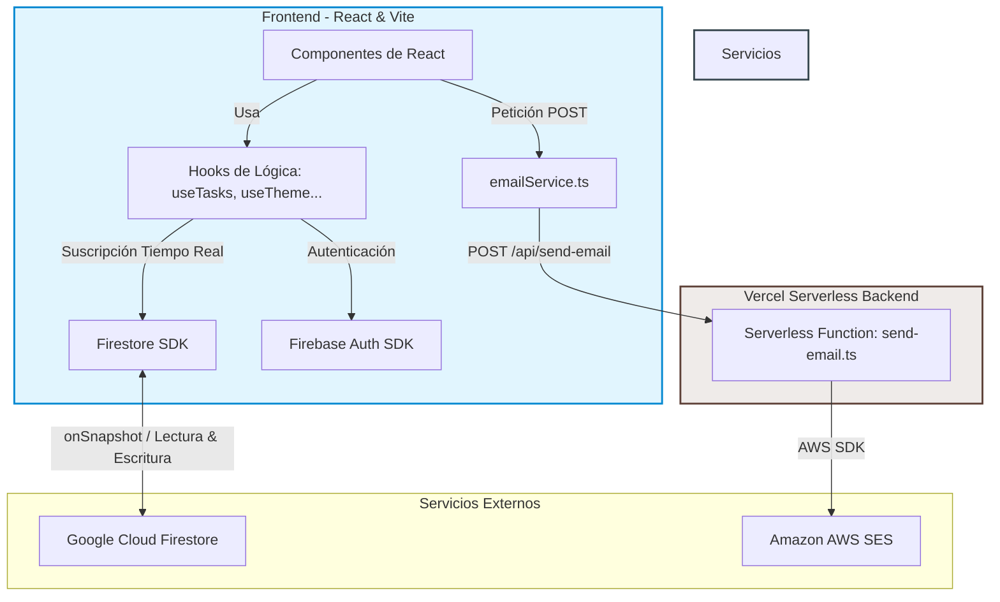

# Mate Code App — Gestor de tareas

SPA de gestión de tareas desarrollada como proyecto integrador del Módulo 4 de Soy Henry. Permite crear, organizar y hacer seguimiento de tareas con soporte de prioridades, fechas de vencimiento, etiquetas y resumen por email.

[](#)
[](#)
[](#)
[](#)
[](#)
[](#)

**URL de producción:** [https://matecode-task-manager.vercel.app](https://matecode-task-manager.vercel.app)

---

## Stack

| Capa | Tecnología |
|---|---|
| Frontend | React 19 + TypeScript, Vite |
| Auth + DB | Firebase Authentication + Firestore |
| Email | AWS SES via Vercel Function |
| Tests | Vitest + React Testing Library |
| Deploy | Vercel (frontend + serverless functions) |

---

## Funcionalidades

- Registro y login con email/password y Google
- Sesión persistente con redirección automática
- Rutas protegidas (sin acceso sin autenticación)
- CRUD completo de tareas con sincronización en tiempo real (Firestore `onSnapshot`)
- Dashboard con saludo personalizado, estadísticas de tareas y barra de progreso
- Campos por tarea: título, descripción, prioridad (baja/media/alta), fecha y hora de vencimiento, etiqueta
- Cards con chips semánticos de prioridad y estado
- Filtros: todas / pendientes / completadas
- Orden: más recientes / por prioridad / por fecha
- Tres temas visuales: Clásico (☀️), Nocturno (🌙), Vívido (✨) — seleccionables por el usuario, persistidos en localStorage y Firestore para sincronizar entre dispositivos
- Resumen de tareas por email con diseño responsive, agrupado por estado y formato de fecha dd/mm/aa 24hs
- Loading skeletons y toast notifications en todas las acciones

---

## Instalación local

```bash
# 1. Clonar el repositorio
git clone <url-del-repo>
cd ProyectoIntegrador-M4-ACPJ

# 2. Instalar dependencias
npm install

# 3. Configurar variables de entorno
cp .env.example .env
# Completar .env con las credenciales reales (ver sección Variables de entorno)

# 4. Iniciar en desarrollo
npm run dev

# 5. Para probar las Vercel Functions localmente (email)
npx vercel dev
```

### Scripts disponibles

```bash
npm run dev       # servidor de desarrollo
npm run build     # build de producción
npm run preview   # preview del build
npm run test      # tests con Vitest
npm run lint      # ESLint
```

---

## Variables de entorno

Copiar `.env.example` a `.env` y completar con los valores reales. Nunca commitear `.env`.

```env
# Firebase — prefijo VITE_ obligatorio para que Vite las exponga al cliente
VITE_FIREBASE_API_KEY=
VITE_FIREBASE_AUTH_DOMAIN=
VITE_FIREBASE_PROJECT_ID=
VITE_FIREBASE_STORAGE_BUCKET=
VITE_FIREBASE_MESSAGING_SENDER_ID=
VITE_FIREBASE_APP_ID=

# AWS SES — SIN prefijo VITE_: solo las usa el servidor (Vercel Function)
AWS_ACCESS_KEY_ID=
AWS_SECRET_ACCESS_KEY=
AWS_REGION=
SES_FROM_EMAIL=

# URL pública de la app (usada en el email de resumen)
APP_URL=https://matecode-task-manager.vercel.app
```

En Vercel, las variables con prefijo `VITE_` se configuran como variables de entorno del proyecto; las sin prefijo solo están disponibles en el servidor.

> **AWS SES en sandbox**: la app está en modo sandbox de AWS SES. Esto significa que el email de resumen solo funciona si el destinatario fue verificado manualmente en la consola de AWS. Si al probar la funcionalidad de email no llega nada, es por esta limitación — no por un error en la app. Para uso en producción real se requiere solicitar a AWS el acceso productivo ("Request production access").

---

## Arquitectura y decisiones técnicas

### Diagrama de Arquitectura del Sistema



### Separación de responsabilidades

Los componentes solo describen qué se muestra. La lógica de negocio vive en hooks (`useTasks`, `useTaskItem`, `useAuth`, `useTheme`) y la comunicación con servicios externos en `src/services/`. Esta separación hace que cada parte del código tenga una razón única para cambiar y facilita el testing de la lógica sin depender del DOM.

```
src/
├── components/   # UI: TaskCard, TaskModal, TaskEditForm, DueChip, Dashboard...
├── hooks/        # Lógica reutilizable: useTasks, useTaskItem, useAuth, useTheme
├── services/     # Firebase, Firestore, emailService
├── pages/        # Vistas: Login, Register, Tasks
├── routes/       # Enrutamiento y rutas protegidas (ProtectedRoute, PublicOnlyRoute)
├── styles/       # Variables CSS globales, temas, estilos base
├── utils/        # Helpers: format.ts, taskHelpers.ts
└── types/        # Interfaces compartidas: Task, TaskFormValues, Theme...

api/
├── send-email.ts       # Vercel Function: recibe payload, llama a SES
└── _emailTemplate.ts   # Template HTML + generateSummaryEmail() — testeable sin SES
```

### Tiempo real con onSnapshot

`useTasks` se suscribe a Firestore con `onSnapshot` y cancela la suscripción al desmontar el componente, evitando fugas de memoria. La query filtra por `userId` tanto en el cliente como en las reglas de Firestore.

### Temas sin flash

El tema se aplica con `data-theme` en `<html>`. Un script inline en `index.html` lee `localStorage` antes del primer render de React para evitar el flash de tema incorrecto. `useLayoutEffect` sincroniza el atributo en cada cambio. El tema también se persiste en `users/{uid}` en Firestore para sincronizar entre dispositivos.

### Credenciales AWS siempre en el servidor

El frontend nunca habla con AWS directamente. Llama a `POST /api/send-email` (Vercel Function), que tiene acceso a las credenciales en variables de entorno del servidor. Las variables sin prefijo `VITE_` no llegan nunca al bundle del cliente.

### Template de email desacoplado del handler

`api/_emailTemplate.ts` exporta `generateSummaryEmail(data)` de forma pura: toma datos, devuelve `{ html, text }`. El handler `send-email.ts` solo valida, mapea el tema a color de acento y llama a SES. Esto permite testear el template sin depender de AWS ni Vercel.

---

## Flujo de email de resumen

1. El usuario hace clic en **📧 Resumen** en el header de la app
2. `Tasks.tsx` llama a `sendTaskSummary(email, tasks, { name, theme })`
3. `emailService.ts` formatea las fechas en zona horaria local (el servidor corre en UTC) y hace `POST /api/send-email`
4. La Vercel Function mapea el tema del usuario a un color de acento (`classic` → `#4F6EF7`, `midnight` → `#5c7cfa`)
5. `generateSummaryEmail()` agrupa las tareas por estado, construye el HTML reemplazando los `{{PLACEHOLDERS}}` en el template, y genera el fallback en texto plano
6. AWS SES envía el email con ambas versiones (HTML + texto)

---

## Seguridad de Firestore

Cada usuario solo puede leer y escribir sus propias tareas. Las reglas validan `userId` tanto en lectura como en escritura:

```
rules_version = '2';
service cloud.firestore {
  match /databases/{database}/documents {
    match /tasks/{taskId} {
      allow read, write: if request.auth != null
        && request.auth.uid == resource.data.userId;
      allow create: if request.auth != null
        && request.auth.uid == request.resource.data.userId;
    }
    match /users/{uid} {
      allow read, write: if request.auth != null && request.auth.uid == uid;
    }
  }
}
```

---

## Tests

```bash
npm run test
```

Cobertura actual: 15 tests en 4 archivos.

- `emailService.test.ts`: verifica que el payload se construye correctamente, que las fechas se formatean en el cliente, y el manejo de errores del serverless
- `_emailTemplate.test.ts`: verifica la generación del HTML sin depender de AWS

---

## Desarrollo Asistido por IA & Ingeniería de Prompts

Este proyecto se desarrolló adoptando metodologías modernas de **Desarrollo Asistido por IA (AI-Assisted Engineering)**, utilizando modelos de lenguaje (principalmente Claude) como un "copiloto de desarrollo" (Peer Programming) enfocado en maximizar la productividad, agilizar el debugging y asegurar la calidad del código.

### Liderazgo y Toma de Decisiones (Mi Rol como Arquitecto)
La IA actuó como un optimizador de procesos, mientras que el diseño conceptual, la arquitectura y las decisiones tecnológicas clave fueron de mi exclusiva autoría:
- **Arquitectura de Software y UI Limpia**: Decisión de implementar CSS Puro con variables dinámicas para evitar dependencias innecesarias (como Tailwind o bibliotecas de componentes), asegurando un control absoluto del performance, los tres temas visuales (Classic/Midnight/Vívido) y transiciones fluidas.
- **Estructura del Sistema**: Diseño y desacoplamiento de la lógica de negocio mediante Hooks personalizados (`useTasks`, `useTheme`, `useAuth`), separándola por completo de la capa de visualización de React.
- **Definición de Producto**: Elección de features premium (como la persistencia multi-dispositivo de temas visuales mediante Firestore, la hora de vencimiento independiente de la fecha, y la agrupación de tareas por estado en el reporte por mail).
- **Seguridad y Cloud**: Diseño del modelo de datos en Firestore y redacción de las reglas de seguridad a nivel de base de datos para restringir el acceso a documentos específicos según el UID del usuario.

### El Rol de la IA como Copiloto de Productividad
El modelo se integró en el flujo de trabajo para resolver cuellos de botella específicos:
- **Micro-Debugging Eficiente**: Diagnóstico ágil de colisiones de especificidad en CSS (como la visibilidad de checkboxes personalizados frente a selectores globales) y exploración de soluciones idiomáticas utilizando pseudoclases como `:not()`.
- **Validación de Patrones y Buenas Prácticas**: Consultas sobre el comportamiento interno de React 19, como la sincronización preventiva de atributos en el DOM usando `useLayoutEffect` en lugar de `useEffect` para evitar flashes visuales de tema (FOUC).
- **Brainstorming de Casos de Prueba**: Generación de hipótesis de error para robustecer la suite de tests en Vitest (por ejemplo, validando el comportamiento del formateo de fechas en zona horaria local vs. el servidor Vercel en UTC).

### Decisión de alcance: asistente de IA descartado

La guía del Proyecto Integrador M4 incluía un asistente conversacional integrado en la app (basado en Gemini API). Al investigar el origen de ese requerimiento, quedó claro que era un componente que había migrado sin revisión desde la guía del Módulo 3 y no formaba parte del alcance real del M4.

Lo intenté integrar de todas formas — llegué a tener la serverless function, el proxy y el system prompt funcionando — pero la evaluación fue clara: la feature agregaba complejidad de mantenimiento, dependía de una API key adicional, y el resultado final no estaba a la altura del resto de la aplicación en términos de UX ni de valor para el usuario. Mantenerla habría comprometido el tiempo y la calidad de las funcionalidades centrales (CRUD, email, responsive, temas).

La decisión de descartarla fue deliberada y responde a un criterio de producto: es preferible tener menos features bien ejecutadas que muchas a medias. El código fue removido en su totalidad del repositorio.

### Vista Previa y Capturas de Pantalla
*(Añadir capturas de pantalla de la aplicación en modo claro, oscuro y el formato del mail responsive)*
- **Dashboard Principal (Tema Nocturno)**: ``
